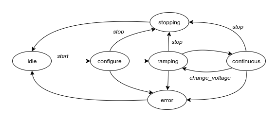

# Diode Measurement

IV/CV measurements for silicon sensors.

## Install

Install using pip in a virtual environment.

```bash
pip install git+https://github.com/hephy-dd/diode-measurement.git@{version}
```

On Windows download a pre-built executable from the release section and run it.

## Build Executable

Building a Windows executable using PyInstaller.

```bash
# Create build environment
python -m venv build_env
. build_env/Scripts/activate

# Install dependencies
pip install -U pip
pip install wheel pyusb pyserial gpib-ctypes
pip install pyinstaller==4.10.* pyinstaller-versionfile==2.0.*
pip install .

# Build executable
pyinstaller pyinstaller.spec
```

An executable will be created in `dist/diode-measurement-{version}.exe`

## Supported Instruments

Source Meter Units

- Keithley K237
- Keithley K2410
- Keithley K2470
- Keithley K2657A

Electro Meter

- Keithley K6514
- Keithley K6517B

LCR Meter

- Keithley K595
- Keysight E4980A
- Agilent 4284A

DMM (Temperature)

- Keithley K2700

## Setup

To interface instruments using a GPIB interface the NI-VISA drivers need to be
installed. Interfacing instruments using TCPIP, USB or Serial port is supported
out of the box by using PyVISA-py, pyusb and pyserial.

The instrument resource name inputs accept follwing formats:

|Format|Example|Result|
|:-----|:------|:-----|
|&lt;n&gt;|16|GPIB::16::INSTR|
|&lt;ip&gt;:&lt;port&gt;|0.0.0.0:1080|TCPIP::0.0.0.0::1080::SOCKET|
|&lt;host&gt;:&lt;port&gt;|localhost:1080|TCPIP::localhost::1080::SOCKET|
|&lt;visa&gt;|GPIB1::16::INSTR|GPIB1::16::INSTR|

## Data formats

The used plain text format consists of a header containing meta data in key and
value pairs and one or more CSV data tables with headers using `\t` separators.

### Synopsis

```
<key>: <value>
...
<<series>[<unit>]\t...>
<<value>\t...>
...
```

### IV

IV measurement data consist of up to two CSV tables with the second (optional)
table containing continuous measurement data.

#### Example

```csv
sample: Unnamed
measurement_type: iv
voltage_begin[V]: +5.000E+00
voltage_end[V]: -1.000E+01
voltage_step[V]: +1.000E+00
waiting_time[s]: +1.000E-01
current_compliance[A]: +1.000E-06

timestamp[s]	voltage[V]	i_smu[A]	i_elm[A]	i_elm2[A]	temperature[degC]
1629455368.29	+5.000E+00	+4.261E-08	+3.740E-08	+NAN	+NAN
1629455369.71	+4.000E+00	+7.708E-08	+9.495E-08	+NAN	+NAN
1629455370.49	+3.000E+00	+3.460E-08	+6.264E-08	+NAN	+NAN
...          	...       	...       	...       	...

timestamp[s]	voltage[V]	i_smu[A]	i_elm[A]	i_elm2[A]	temperature[degC]
1629455385.69	+3.000E+00	+3.996E-04	+7.137E-08	+NAN	+NAN
1629455387.65	+3.000E+00	+7.353E-04	+3.079E-08	+NAN	+NAN
1629455389.56	+3.000E+00	+9.081E-04	+1.266E-08	+NAN	+NAN
...          	...       	...       	...       	...
```

### IV Bias

IV bias measurement data consist of up to two CSV tables with the second
(optional) table containing continuous bias measurement data.

#### Example

```csv
sample: Unnamed
measurement_type: iv_bias
bias_voltage[V]: +1.000E+01
voltage_begin[V]: +5.000E+00
voltage_end[V]: -1.000E+01
voltage_step[V]: +1.000E+00
waiting_time[s]: +1.000E-01
current_compliance[A]: +1.000E-06

timestamp[s]	voltage[V]	i_smu[A]	i_smu2[A]	i_elm[A]	i_elm2[A]	temperature[degC]
1629455368.29	+5.000E+00	+4.261E-08	+3.723E-08	+3.740E-08	+NAN	+NAN
1629455369.71	+4.000E+00	+7.708E-08	+6.513E-08	+9.495E-08	+NAN	+NAN
1629455370.49	+3.000E+00	+3.460E-08	+2.410E-08	+6.264E-08	+NAN	+NAN
...          	...       	...       	...       	...       	...

timestamp[s]	voltage[V]	i_smu[A]	i_smu2[A]	i_elm[A]	i_elm2[A]	temperature[degC]
1629455385.69	+3.000E+00	+3.996E-08	+2.657E-08	+7.137E-08	+NAN	+NAN
1629455387.65	+3.000E+00	+7.353E-08	+6.154E-08	+3.079E-08	+NAN	+NAN
1629455389.56	+3.000E+00	+9.081E-08	+8.426E-08	+1.266E-08	+NAN	+NAN
...          	...       	...       	...       	...       	...
```

### CV

CV measurement data consist of a single CSV table containing the measurement
data.

#### Example

```csv
sample: Unnamed
measurement_type: cv
voltage_begin[V]: +5.000E+00
voltage_end[V]: -1.000E+01
voltage_step[V]: +1.000E+00
waiting_time[s]: +1.000E-01
current_compliance[A]: +1.000E-08

timestamp[s]	voltage[V]	i_smu[A]	c_lcr[F]	c2_lcr[F]	r_lcr[Ohm]	temperature[degC]
1629455368.29	+5.000E+00	+4.261E-08	+3.740E-05	7.149E+08	3.459932E-01	+NAN
1629455369.71	+4.000E+00	+7.708E-08	+9.495E-05	1.109E+08	3.015286E-01	+NAN
1629455370.49	+3.000E+00	+3.460E-08	+6.264E-05	2.549E+08	2.482018E-01	+NAN
...          	...       	...       	...       	...      	...      	...
```

## JSON-RPC

The application provides an [JSON-RPC](https://www.jsonrpc.org/) (remote
procedure call) version 2.0 interface using a TCP server.

### Methods

#### Start

Start notification starts a new measurement.

```json
{"jsonrpc": "2.0", "method": "start"}
```

Optional parameters are `continuous` (Boolean), `reset` (Boolean),
`auto_reconnect` (Boolean), `begin_voltage` (Volt), `end_voltage` (Volt),
`step_voltage` (Volt), `waiting_time` (seconds), `compliance` (Ampere) and
`waiting_time_continuous` (seconds). Specified values will be applied to the
user interface before starting the measurement.

```json
{"jsonrpc": "2.0", "method": "start", "params": {"reset": true, "end_voltage": -100.0, "step_voltage": 10.0, "waiting_time": 1.0}}
```

#### Stop

Stop notification stops an active measurement.

```json
{"jsonrpc": "2.0", "method": "stop"}
```

#### Change voltage

Change voltage notification applies only during continuous It measurement.

Required parameter `end_voltage` (Volt).

Optional parameters with default values are `step_voltage` (default is `1.0`
Volt) and `waiting_time` (default is `1.0` seconds).

```json
{"jsonrpc": "2.0", "method": "change_voltage", "params": {"end_voltage": 100.0, "step_voltage": 10.0, "waiting_time": 0.25}}
```

#### State

Request an application state snapshot.

```json
{"jsonrpc": "2.0", "method": "state", "id": 0}
```

This will return application state parameters.

```json
{"jsonrpc": "2.0", "result": {"state": "ramping", "measurement_type": "iv", "sample": "VPX1", "source_voltage": 24.0, "smu_current": 0.0025, "smu2_current": 0.0018, "elm_current": 0.0021, "elm2_current": null, "lcr_capacity": null, "temperature": 24.031}, "id": 0}
```

### States

Following states are exposed by the state snapshot: `idle`, `configure`,
`ramping`, `continuous`, `stopping`.



### Example

Example using [netcat](https://en.wikipedia.org/wiki/Netcat) to initiate a new
measurement and applies a new end voltage.

```bash
echo '{"jsonrpc": "2.0", "method": "start", "params": {"end_voltage": 100.0}}' | nc localhost 8000
```

Example using Python to read application state from TCP server.

```python
import json
import socket

with socket.socket(socket.AF_INET, socket.SOCK_STREAM) as sock:
    sock.connect(('localhost', 8000))
    request = {
      "jsonrpc": "2.0",
      "method": "state",
      "id": None
    }
    sock.sendall(json.dumps(request).encode('utf-8'))
    print(sock.recv(4096).decode('utf-8'))
```
